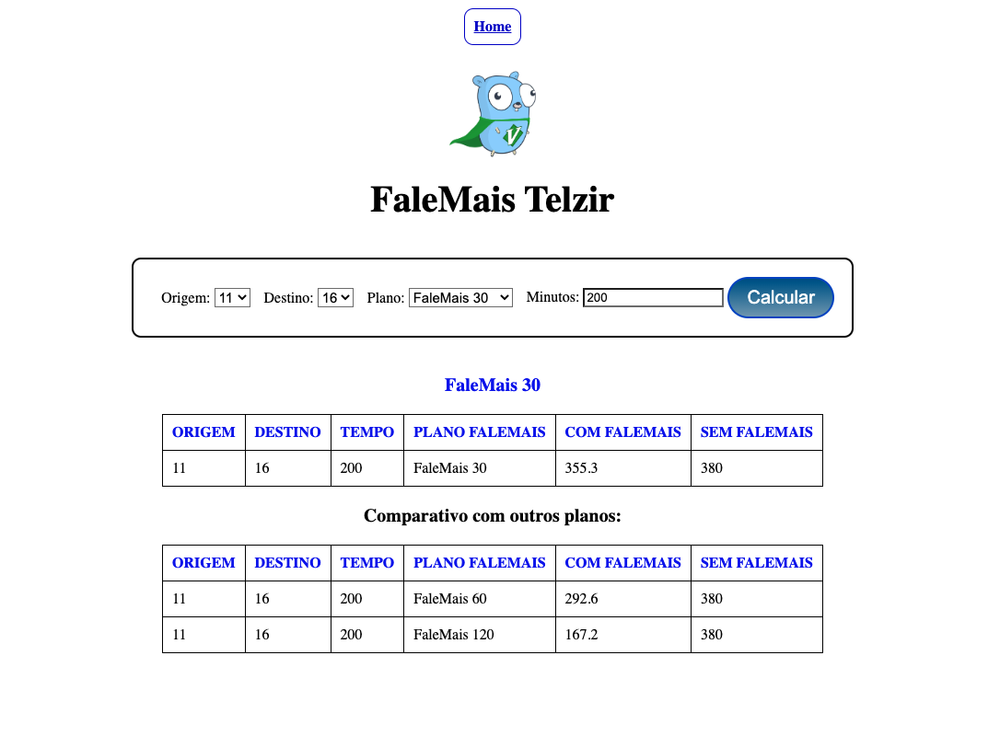

# Falemais Telzir #

Projeto Fullstack que calcula e compara os valores de uma ligação telefônica entre regiões diferentes 
com base em planos de tarifas pré-definidos.

## Conteúdos

- [Visão Geral do Projeto](#general-view)
    - [O Desafio](#o-desafio)
- [O Desenvolvimento](#the-development-process)
    - [Skills Usadas](#tools-used)
    - [Lessons learned](#lessons-learned)
- [Uso](#usage)
- [Author](#author)

## Visão geral

## Imagem

<div align="center">
  
</div>

### O desafio

É um projeto fullstack que calcula e compara os valores de uma ligação telefônica entre regiões diferentes 
com base em planos de tarifas pré-definidos.

### Para acessar o readme do backend acesse o link abaixo:

https://github.com/beto-ouverney/falemais-telzir/blob/main/backend/README.md

**O usuário será capaz de**

Calcular e comparar os valores de uma ligação telefônica entre regiões diferentes
com base em planos de tarifas pré-definidos.

## O Desenvolvimento

Foi utilizado o método TDD, para o desenvolvimento. Foi escolhido chi como router por
este possuir o melhor benchmark de performance, e o banco de dados escolhido foi o PostgreSQL. Todo o backend está dockerizado.
Para documentação foi utilizado o Swagger.

No FrontEnd foi utilizado o Vue.js com Typescript e Sass

### Backend

- [Golang](https://golang.org/)
- [PostgreSQL](https://www.postgresql.org/)
- [Swagger](https://swagger.io/)
- [Chi](https://github.com/go-chi/chi)
- [Docker](https://www.docker.com/)

### Frontend

- [Vue.js](https://vuejs.org/)
- [Typescript](https://www.typescriptlang.org/)
- [Sass](https://sass-lang.com/)

## Uso

- Clone o repositório
```bash
  git@github.com:beto-ouverney/falemais-telzir.git
```

- Utilize o comando abaixo para ver todos os comandos disponíveis
```bash
  make help
```

- Utilize o comando abaixo para subir os containers do Projeto em modo de teste
```bash
make docker-test-up
```
- exitem dois bancos, um para uso continuo e outro somente para testes,
- para que não haja conflito entre os dados de teste e os dados de uso continuo.
- Por padrão ele vem setado para o banco de teste, para mudar deve renomear o .env para .env.test e renomear o .env.dev para .env

- Utilize o comando abaixo para subir os containers do Projeto em modo de desenvolvimento
```bash
make docker-up
```
- Para eliminar os containers de testes utilize o comando abaixo:

```bash
make docker-test-down
```

- Para eliminar os containers de desenvolvimento utilize o comando abaixo:

```bash
make docker-down
```

- Para rodar o backend no container:

- Para acessar o container do backend de testes use o comando abaixo:

```bash
make back-container-test
```

Para acessar o container do backend use o comando abaixo:

```bash
make back-container
```

- Para rodar o backend
- 
```bash
make run
```

## Test

* O Banco de testes deve estar ativo e as variaveis de ambientes de testes também, senão nao rodará todos os testes somente os mockados.
    - Nos testes dos handlers, o o banco de dados é populado no inico de cada teste e depois é feito um drop.

- Para conseguir rodar todos os testes deve ser acessado o container do backend

- Para rodar os testes use o comando abaixo dntro do container do backend:

```bash
     go test -v ./...
```

- Para rodar o frontend

```bash
make run-front
```

- Para visualizar a documentação da API:
* use o endpoint /api/v1/dddcost/swagger/index.html
 
## Author

- LinkedIn - [Alberto Ouverney Paz](https://www.linkedin.com/in/beto-ouverney-paz/)
